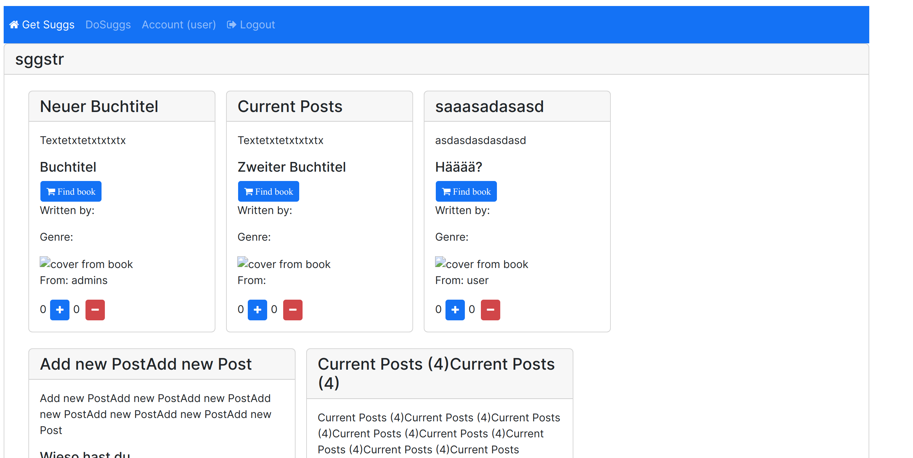

# sggstr

sggstr is a example webapp for users create and get suggestions for different entertainment content.

## npm
1. Run MongoDB: 
`mongod`
2. Build: `npm run builddev` for dev or `npm run build` for prod
3. Run dev `npm run dev`: [localhost:4200](http://localhost:4200).
4. Run pro `npm run prod`: [localhost:3000](http://localhost:3000)

## tests
Run `ng test` for frontend unit tests via [Karma](https://karma-runner.github.io).

Run `npm run testbe` to execute the backend tests via [Mocha](https://mochajs.org/).

## see suggestions

## create suggestions

